# UI 설명서

> 화면별로 영역을 나누고 무엇을 하는 자리인지 적는다. 원본 캡처는
> [../../Screenshots/](../../Screenshots/), 번호를 매긴 것은
> [../../Screenshots/numbered/](../../Screenshots/numbered/) 에 있다.
>
> **보스전(8장)은 아직 캡처가 없다** — 사정은 8장에 있다.

---

## 캡처를 다시 찍으면

번호본도 같은 이름으로 다시 그린다. 표의 번호대로 영역에 사각형과 숫자를 넣고, 색은
청록색 한 가지로 통일한다 (예시 자료와 같은 색). 그림판으로 충분하다.

---

## 1. 시작 화면 — `start.png`

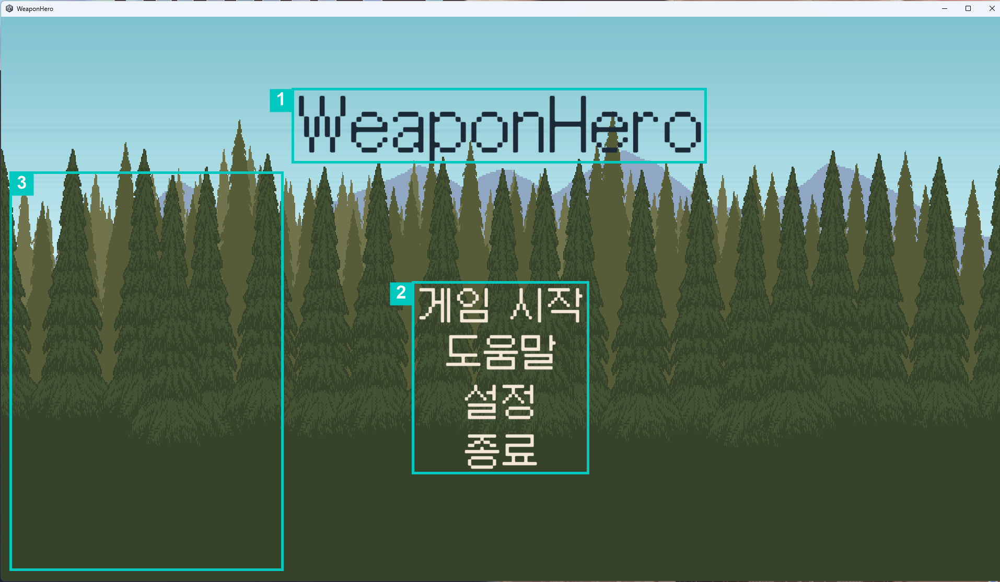

| 번호 | 영역 | 설명 |
|---|---|---|
| 1 | 타이틀 | 게임 이름. 창 제목과 실행 파일 이름도 같은 `WeaponHero` 다 |
| 2 | 메뉴 | 게임 시작 · 도움말 · 설정 · 종료 |
| 3 | 배경 | 시작 화면 전용 배경. 전투 씬과 다른 씬이다 |

> `TC-UI-01` 이 여기 걸린다 — 켜자마자 글자가 한 프레임 깜빡이던 것을 최종 빌드에서
> 고쳤고, 1회전에서 유지되는 것을 확인했다.

## 2. 도움말 — `controls.png` · `controls_en.png`

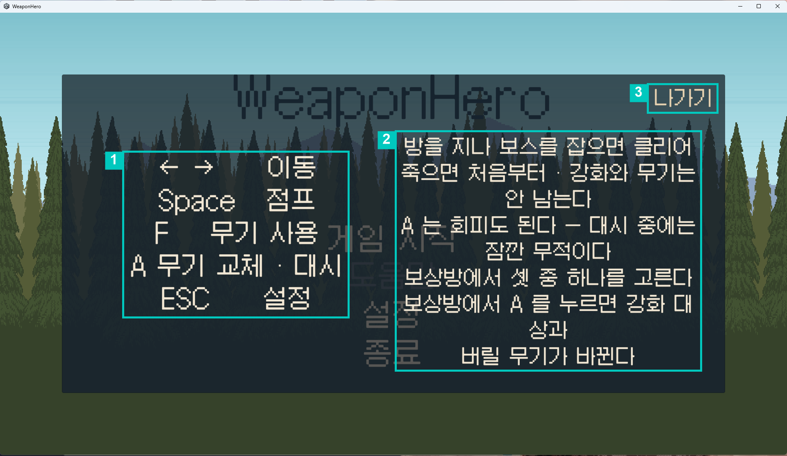
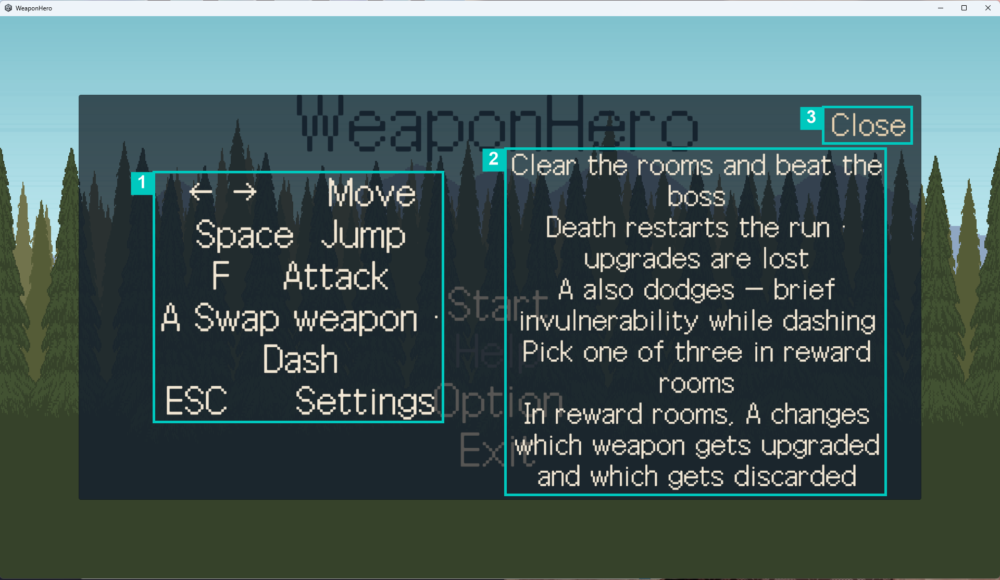

| 번호 | 영역 | 설명 |
|---|---|---|
| 1 | 조작표 | 이동 · 점프 · 무기 사용 · 무기 교체 · 설정 다섯 줄 |
| 2 | 규칙 설명 | 클리어 조건 · 사망 시 손실 · 스왑의 회피 기능 · 보상 선택 |
| 3 | 나가기 | 시작 화면으로 |

> **결함 [#148](../../../issues/148)** — 2번에 *"보상방에서 셋 중 하나를 고른다"* 가 있지만
> **어떤 키인지가 없다.** 실제로는 클릭과 숫자키 1·2·3 이 둘 다 동작한다. 한국어·영어 동일.

## 3. 설정 — `settings.png` · `settings_en.png`

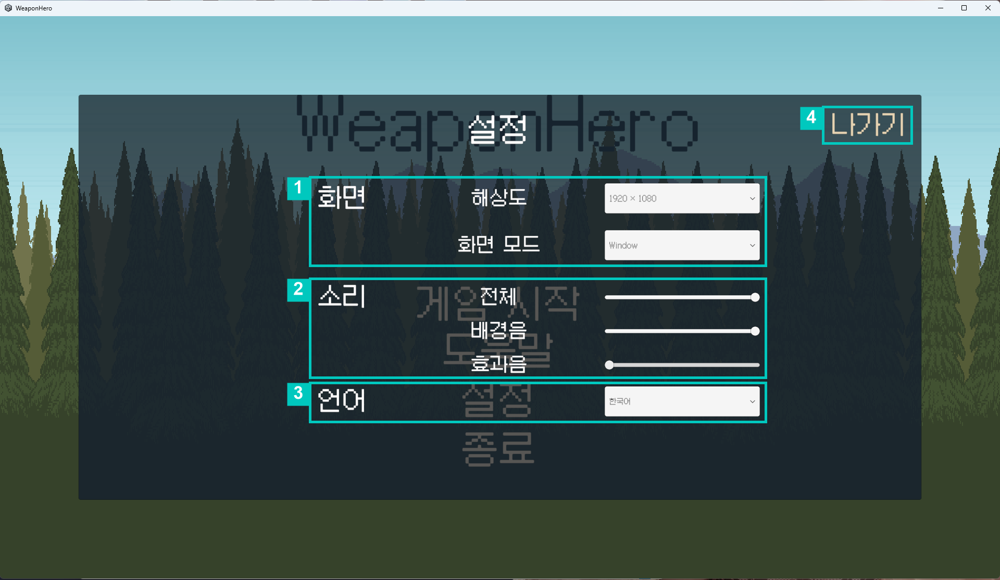
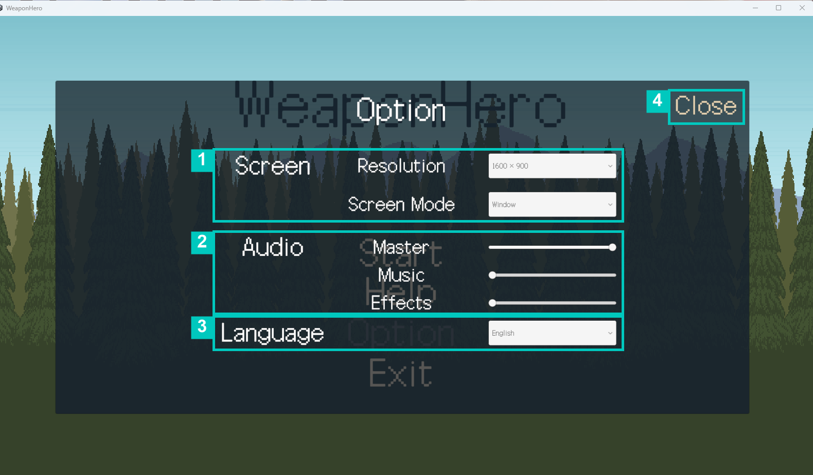

| 번호 | 영역 | 설명 |
|---|---|---|
| 1 | 화면 | 해상도 · 화면 모드 드롭다운 |
| 2 | 소리 | 전체 · 배경음 · 효과음 슬라이더 |
| 3 | 언어 | 한국어 · English. **시작 화면에만 있다** — 전투 중에는 안 보인다 |
| 4 | 나가기 | 이전 화면으로 |

> 3번이 씬에 따라 다르다. `TC-UI-06` 이 그것을 확인하고, `TC-EDGE-22` 는 그래서
> **해당 없음**으로 판정됐다 — 전투 중에는 언어를 바꾸는 조작 자체가 없다.

## 4. 전투 — `combat.png`

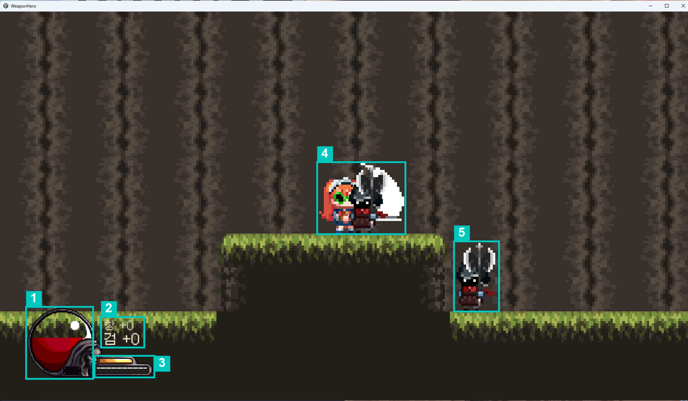

| 번호 | 영역 | 설명 |
|---|---|---|
| 1 | 체력 | 구슬 형태. 피격과 처치 회복이 여기 반영된다 |
| 2 | 무기 슬롯 | 두 칸과 각 무기의 강화 수치. 활성 무기가 아래 — 더 크고 밝게 표시된다 |
| 3 | 스왑 게이지 | 슬롯 아래. 쿨타임 3.3초가 차는 동안 교체가 막힌다 |
| 4 | 플레이어 · 공격 | 3타 콤보. 지상 공격은 조금 전진한다 |
| 5 | 적 | 돌진형 · 원거리형이 외형으로 갈린다 (#96 에서 고친 것) |

> 이 캡처에는 **같은 종류 둘만 잡혔다.** 4번 안에 플레이어와 겹친 적이 하나 더 있다.
> 5번의 "외형으로 갈린다"를 보여주려면 두 종류가 같이 나오는 장면을 다시 찍어야 한다.

## 5. 무기 스왑 — `swap.png`

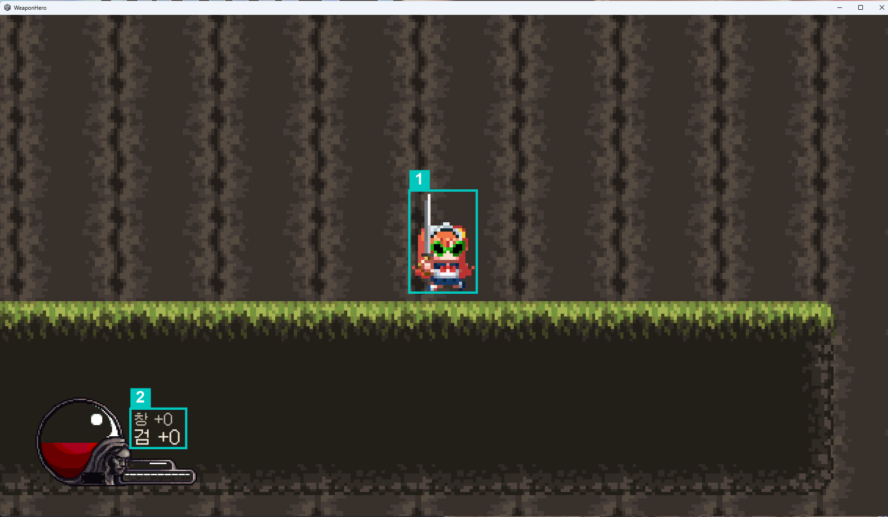

| 번호 | 영역 | 설명 |
|---|---|---|
| 1 | 교체 직후 플레이어 | 외형과 모션이 함께 바뀐다 |
| 2 | 슬롯 표시 | 활성 무기가 바뀐 것이 HUD 에 즉시 반영된다 |

> 스왑에는 짧은 대시와 무적이 붙어 **교체가 회피이자 진입 수단**이다. 대시 중에는
> 이동 · 점프 · 공격 · 재스왑이 전부 막힌다 (`TC-SWAP-06`).

## 6. 방 전환 — `portal.png`

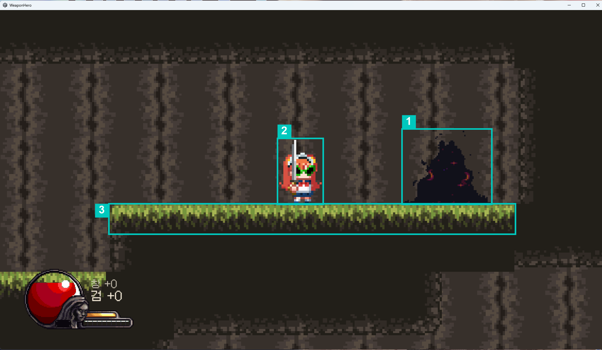

| 번호 | 영역 | 설명 |
|---|---|---|
| 1 | 출구 포탈 | 방을 다 치우면 열린다. 밟으면 다음 방 |
| 2 | 플레이어 | |
| 3 | 방 구조 | 방은 전투 · 보상 · 보스 세 타입이고 핸들러가 갈린다 |

## 7. 보상 — `reward.png`

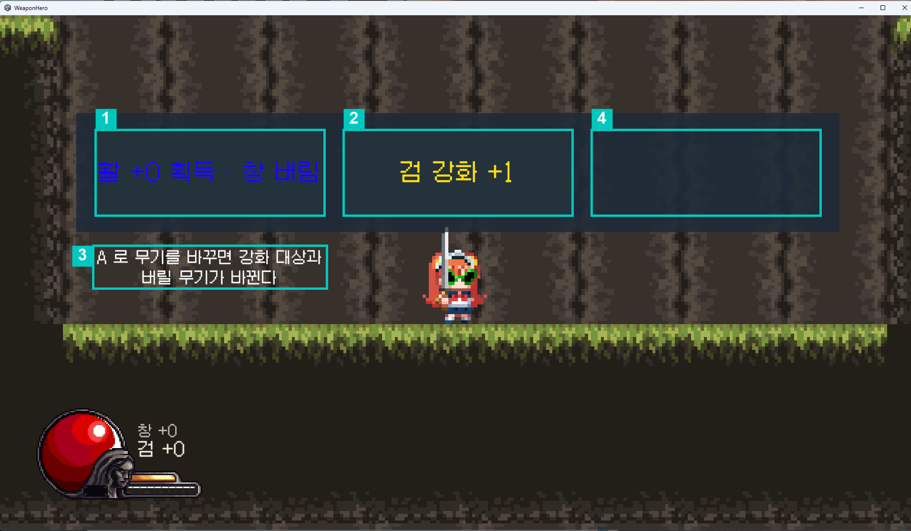

| 번호 | 영역 | 설명 |
|---|---|---|
| 1 | 무기 카드 | 안 가진 무기를 얻고 한 자루를 버린다. 강화 레벨은 승계된다 |
| 2 | 강화 카드 | 활성 무기를 +1 |
| 3 | 안내 | `A` 로 무기를 바꾸면 **강화 대상과 버릴 무기가 함께 바뀐다** |
| 4 | 빈 자리 | 체력이 가득해 회복 카드가 빠진 상태 |

> **결함 [#151](../../../issues/151)** — 4번이 그 결함이다. 카드가 둘이면 오른쪽 3분의 1이
> 빈 채로 남아 "뭔가 못 받았나"로 읽힌다.
>
> **결함 [#149](../../../issues/149)** — 숫자키로 고르면 보상은 적용되는데 **패널이 안 닫힌다.**

## 8. 보스전 — 캡처 없음

**1회전의 `boss.png` 는 보상 화면이 같은 내용으로 한 번 더 저장된 것이다** (`reward.png`
와 해시가 같다). 다시 찍어 같은 이름으로 덮어쓸 때까지 이 파일은 보스전이 아니다.

아래 표는 새로 찍은 캡처에 번호를 매길 기준이다.

| 번호 | 영역 | 설명 |
|---|---|---|
| 1 | 보스 | 오우거. 패턴 3개 — Smash(0~1.8) · Charge(1.6~3.5) · Throw(3~10) |
| 2 | 플레이어 | |
| 3 | HUD | 전투 화면과 같다 |

> **결함 [#150](../../../issues/150)** — 보스는 **공격 예고 색이 보이지 않는다.** 패턴 셋이 전부
> 중단 불가(`interruptible: 0`)라 예고가 유일한 회피 신호인데 그것이 안 읽힌다.

## 9. 일시정지 — `pause.png`

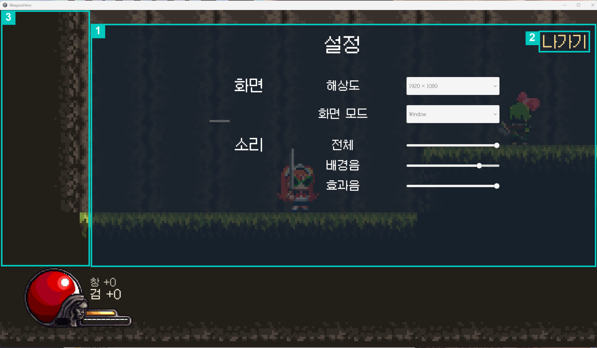

| 번호 | 영역 | 설명 |
|---|---|---|
| 1 | 설정 패널 | 전투 중 `ESC`. 시작 화면과 같은 프리팹을 쓴다 |
| 2 | 나가기 | 게임으로 돌아간다 |
| 3 | 멈춘 전투 화면 | 이동 · 점프 · 공격 입력이 전부 막힌다 (`TC-EDGE-21`) |

> **결함 [#152](../../../issues/152)** — 여기서 해상도를 바꾸면 **1번의 위치가 어긋난다.**
> HUD 는 멀쩡하다.

## 10. 결과 — `result.png` · `result_en.png`

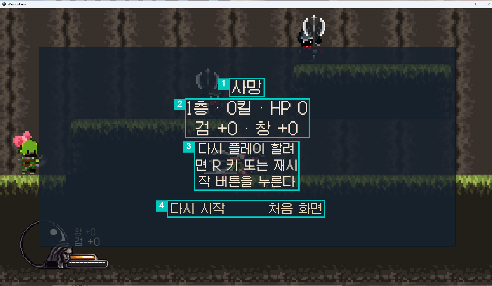
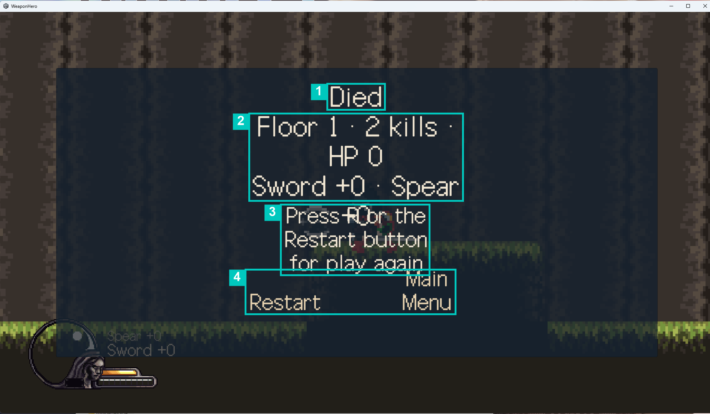

| 번호 | 영역 | 설명 |
|---|---|---|
| 1 | 결과 | 사망 또는 클리어 |
| 2 | 요약 | 도달 층 · 처치 수 · 남은 체력 · 무기와 강화 |
| 3 | 안내 | `R` 키 또는 재시작 버튼 |
| 4 | 버튼 | 다시 시작 · 처음 화면 |

> **결함 [#153](../../../issues/153)** — 영어에서 2번이 넘쳐 3번과 겹친다. 번역은 되어 있고
> 배치만 깨진다. 한국어는 3번의 줄바꿈이 단어 중간에서 끊기고 맞춤법 오류(`할려면`)가 있다.

---

## 이 문서의 쓸모

화면 설명이면서 **결함이 어느 자리에서 나왔는지의 지도**다. 결함 7건 중 다섯이 특정
화면에 붙어 있어서, 발표 자료에서는 이 표와 결함 목록을 나란히 두면 설명이 짧아진다.

| 화면 | 결함 |
|---|---|
| 도움말 | [#148](../../../issues/148) |
| 보상 | [#149](../../../issues/149) · [#151](../../../issues/151) |
| 보스전 | [#150](../../../issues/150) |
| 일시정지 | [#152](../../../issues/152) |
| 결과 | [#153](../../../issues/153) |
